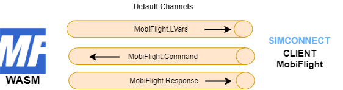
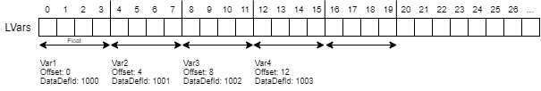

## MobiFlight WASM Module

This standalone WASM module for Microsoft Flight Simulator 2020 enables us to send events to the sim and execute them in the context of the aircraft gauges system. Also it provides SimConnect access to certain variable types which are not accessible otherwise.
With this module you can interface your home cockpit hardware more efficiently.

This module also is released together with the MobiFlight Connector application as part of the MobiFlight Open Source Project - [https://mobiflight.com].

### Variable access

WASM modules in general are able to execute gauge calculator scripts, which can be used to read special variables like L- or A-Variables ([execute_calculator_code](https://docs.flightsimulator.com/html/Programming_Tools/WASM/Gauge_API/execute_calculator_code.htm)). They can communicate and exchange data with external SimConnect clients via newly created shared memory areas ([CreateClientData](https://docs.flightsimulator.com/html/Programming_Tools/SimConnect/API_Reference/Events_And_Data/SimConnect_CreateClientData.htm)). 

The MobiFlight WASM module uses three shared memory areas/channels for communication with an external SimConnect client. 

- The *Command-Channel* to receive commands from the external SimConnect client.
- The *LVars-Channel* to continuously provide the variable data to the SimConnect client.
- The *Response-Channel* to send other information to the SimConnect client. 

The default channels for the MobiFlight client are auto created on startup. Each channel has a fix unique name.



#### Communication protocol

| Command (string)| Responses (string) | LVars value (float/string) |
| ----------- | ----------- | ---------|
| ```MF.Ping```| ```MF.Pong```|
| ```MF.LVars.List``` | ```MF.LVars.List.Start``` <br> ```A32NX_AUTOPILOT_1_ACTIVE``` <br> ```A32NX_AUTOPILOT_HEADING_SELECTED``` <br> ```...``` <br> ```MF.LVars.List.End```|
| ```MF.SimVars.Add.(A:GROUND ALTITUDE,Meters)``` || ```e.g. 1455.23 (float)``` |
| ```MF.SimVars.AddString.(A:GPS WP NEXT ID,String)``` || ```e.g. EDDS (string)``` |
| ```MF.SimVars.Clear``` |||
| ```MF.SimVars.Set.5 (>L:MyVar)```|||
| ```MF.Clients.Add.ClientName```|```MF.Clients.Add.ClientName.Finished```||
| ```MF.Config.MAX_VARS_PER_FRAME.Set.30```|||
| ```MF.Version.Get```|```MF.Version.0.6.0```||


**MF.SimVars.Add.**
The "SimVars.Add." command needs to be extended with a gauge calculator script for reading a variable, like shown in the table. Each added variable needs 4 reserved bytes to return its float value in the LVars channel. The bytes are  allocated in the order of the LVars being added. The first variable starts at offset 0, the second at offset 4, the third at offset 8 and so on. To access each value, the external SimConnect clients needs a unique DataDefinitionId for each memory segment. It is recommended to start with ID 1000. 



**MF.SimVars.AddString.**
The "SimVars.AddString." command works similar to the "SimVars.Add." command but the string result of the gauge calculator script is used. The size of a single string can be up to 128 bytes, which allows handling a total of 64 string variables. The first variable starts at offset 0, the second at offset 128, the third at offset 256 and so on. To access each value, the external SimConnect clients needs a unique DataDefinitionId for each memory segment. It is recommended to start with ID 10000.

**MF.Clients.Add.**
The default channels are reserved for communication with the MobiFlight client. But they can be used to request additional channels for other SimConnect clients as well. If another client wants to use the WASM module for variable access, it can register itself with the command ```MF.Clients.Add.MyClientName``` using the default command channel. The WASM module then creates the new shared memory channels "MyClientName.LVars", "MyClientName.Command", "MyClientName.Response" and informs the client with ```MF.Clients.Add.ClientName.Finished```.

#### Implementation details for external SimConnect clients
The MobiFlight default client code can be found [here](https://github.com/MobiFlight/MobiFlight-Connector/blob/main/SimConnectMSFS/SimConnectCache.cs) and [here](https://github.com/MobiFlight/MobiFlight-Connector/blob/main/SimConnectMSFS/WasmModuleClient.cs).

First the client needs to map each shared memory aka ClientDataArea with [MapClientDataNameToID](https://docs.flightsimulator.com/html/Programming_Tools/SimConnect/API_Reference/Events_And_Data/SimConnect_MapClientDataNameToID.htm) using the correct name and a new ID for each ClientDataArea. 

Then the client needs to add each memory segment (=variable) it wants to access to its data definition with [AddToClientDataDefinition](https://docs.flightsimulator.com/html/Programming_Tools/SimConnect/API_Reference/Events_And_Data/SimConnect_AddToClientDataDefinition.htm). For each segment a not yet used DefinitionId must be provided. ClientDataDefinitions cannot be reused across different ClientDataAreas and the DefinitionIds must be unique in the context of the client.

Finally the client can subscribe to changes in the Response- or LVar-channel with [RequestClientData](https://docs.flightsimulator.com/html/Programming_Tools/SimConnect/API_Reference/Events_And_Data/SimConnect_RequestClientData.htm) using the SIMCONNECT_PERIOD_ON_SET parameter. 

Sending a command in the Command-channel can be done with [SetClientData](https://docs.flightsimulator.com/html/Programming_Tools/SimConnect/API_Reference/Events_And_Data/SimConnect_SetClientData.htm). Hint: Sometimes the first command after a new start of the client  via SetClientData seems to be ignored, therefore send an arbitrary dummy command in the beginning. 

#### How to use MobiFlight WASM to read variables with your own SimConnect Client
1) Subscribe to the *"MobiFlight.Response"* channel.
2) Register your new client "MyGreatClient" via the *"MobiFlight.Command"* channel: ```MF.Clients.Add.MyGreatClient```
3) After getting the response ```MF.Clients.Add.MyGreatClient.Finished```, map and use your new communication channels (ClientDataAreas) *"MyGreatClient.LVars"*, *"MyGreatClient.Command"*, *"MyGreatClient.Response"*. 
4) Add Variables via the *"MyGreatClient.Command"* channel: ```MF.SimVars.Add.(xxx).```
5) Receive the values via the *"MyGreatClient.LVars"* channel.


A Python example implementation can be found [here](https://github.com/Koseng/MSFSPythonSimConnectMobiFlightExtension/blob/main/prototype/mobiflight_variable_requests.py).


